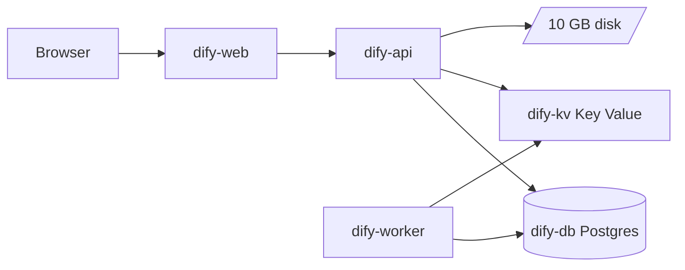

# Dify on Render

> One-click self-hosted Dify: build LLM apps, RAG pipelines, and agent workflows with managed Postgres (pgvector), Key Value, and a Celery worker.

[](https://render.com/deploy-template/api/github/start?template_repo=dify-render-template)

This repo is the **full [Dify](https://github.com/langgenius/dify) application** (API, web, worker sources at tag **1.14.2**) plus a Render Blueprint. Deploy uses official `langgenius/dify-api` and `langgenius/dify-web` Docker images: no multi-GB build on Render unless you change `render.yaml` to build from source.


**At a glance:** ~$75–85/mo (Oregon) · first deploy ~15–25 min · no LLM keys at Apply time

> **Gallery listing:** Catalog entry pending Sanity CMS — see [SANITY-SUBMISSION.md](./SANITY-SUBMISSION.md).

---

## Deploy

Use the **Deploy to Render** button above. Do **not** use GitHub's green **Use this template** button alone: that only copies the repo on GitHub and does not start a Render deploy.

1. Click **[Deploy to Render](https://render.com/deploy-template/api/github/start?template_repo=dify-render-template)**.
2. Authorize the Render GitHub App if prompted, then pick **your personal GitHub account** (not `render-examples`). Render creates `<your-account>/dify-render-template` from this template.
3. On the Blueprint Apply screen, confirm the six resources (`dify-api`, `dify-worker`, `dify-web`, `dify-kv`, `dify-db`, disk). `SECRET_KEY` is auto-generated.
4. Click **Apply**. First deploy typically takes **15–25 minutes**.
5. Open the **`dify-web`** URL (`https://dify-web-xxxx.onrender.com/install`) and create your admin account.
6. In **Settings → Model Provider**, add at least one LLM API key.

The connected Git repo in Render should be **`your-username/dify-render-template`**, not `render-examples/dify-render-template`. If you only land on the org repo page on GitHub, you clicked the wrong control or need to finish the Render OAuth flow.

---

## Table of contents

- [Deploy](#deploy)
- [Why deploy Dify on Render](#why-deploy-dify-on-render)
- [Use cases](#use-cases)
- [What gets deployed](#what-gets-deployed)
- [Quickstart](#quickstart)
- [Configuration](#configuration)
- [Cost breakdown](#cost-breakdown)
- [Customization](#customization)
- [Operations](#operations)
- [Upgrading](#upgrading)
- [Troubleshooting](#troubleshooting)
- [FAQ](#faq)
- [Security](#security)
- [Caveats and limitations](#caveats-and-limitations)
- [Credits and license](#credits-and-license)

---

## Why deploy Dify on Render

- **Managed Postgres with pgvector** — The API runs `CREATE EXTENSION vector` on first deploy; embeddings use the same database as app data.
- **Key Value wired for Celery** — Broker and cache connection strings are injected from a Render Key Value instance; no separate Redis host to provision manually.
- **Official upstream images** — `langgenius/dify-api` and `langgenius/dify-web` at a pinned tag; no multi-GB Node build on every deploy.
- **URL wiring is automatic** — Console, app, and API URLs are set from service discovery so CORS and redirects work across `*.onrender.com` hosts.

---

## Use cases

- **Internal LLM app builder** — Teams prototype chatbots and agents without a separate PaaS.
- **RAG over private documents** — Connect knowledge bases and vector search using pgvector on Render Postgres.
- **Workflow automation** — Chain tools, HTTP calls, and models in Dify workflows; Celery runs long tasks on the worker.
- **Multi-model gateway** — Configure OpenAI, Anthropic, and other providers in the Dify console after deploy.

---

## What gets deployed



| Resource | Type | Plan | Purpose |
|----------|------|------|---------|
| `dify-web` | Web (image) | Starter | Next.js console and app UI |
| `dify-api` | Web (image) | Standard | HTTP API, migrations, file storage |
| `dify-worker` | Worker (image) | Standard | Celery async jobs |
| `dify-kv` | Key Value | Starter | Celery broker + Redis cache |
| `dify-db` | PostgreSQL 16 | Basic 256MB | App data + pgvector |
| `dify-api-storage` | Disk 10 GB | — | Uploads at `/app/api/storage` |

Region: **Oregon** (`oregon`). Change `region` in `render.yaml` before deploy if you need another region.

Image pin: **1.14.2** (`langgenius/dify-api`, `langgenius/dify-web`).

---

## Quickstart

Same steps as [Deploy](#deploy) above. Summary:

1. **[Deploy to Render](https://render.com/deploy-template/api/github/start?template_repo=dify-render-template)** → fork into your GitHub account → Blueprint Apply.
2. Open **`dify-web`** after services are live and finish Dify install.
3. Add a model provider key in the console.

---

## Configuration

### Required secrets

None at Blueprint apply time. First-run admin credentials are set in the Dify install wizard after deploy.

### Auto-generated secrets

| Env var | Service | Purpose |
|---------|---------|---------|
| `SECRET_KEY` | `dify-api` | Session and crypto for Dify |

**Do not rotate `SECRET_KEY` after deploy** without following Dify's migration guidance: existing sessions and encrypted data can break.

### Wired automatically

| Env var | Source |
|---------|--------|
| `DATABASE_URL`, `DB_*` | `dify-db` |
| `REDIS_*`, `CELERY_BROKER_URL` | `dify-kv` |
| `PGVECTOR_*` | `dify-db` |
| `CONSOLE_API_URL`, `SERVICE_API_URL`, `FILES_URL`, `INTERNAL_FILES_URL` | `dify-api` |
| `CONSOLE_WEB_URL`, `APP_WEB_URL` | `dify-web` |
| `CONSOLE_API_URL`, `APP_API_URL` (web) | `dify-api` |
| `SECRET_KEY` (worker) | `dify-api` |

### Optional tweaks

| Env var | Default | Notes |
|---------|---------|-------|
| `LOG_LEVEL` | `INFO` | Set `DEBUG` only when troubleshooting |
| `INIT_PASSWORD` | unset | Optional deploy gate on `dify-api`; not recommended on split `*.onrender.com` hosts (see Troubleshooting) |
| `STORAGE_TYPE` | `opendal` + `fs` | Switch to `s3` and set `S3_*` for durable multi-instance storage |
| `OPENAI_API_KEY` | unset | Can set in Dashboard or only in Dify UI |
| Image tag in `render.yaml` | `1.14.2` | Pin to another [release tag](https://github.com/langgenius/dify/releases) |

See [.env.example](./.env.example) for optional provider and S3 variables.

---

## Cost breakdown

Approximate monthly cost on [Render pricing](https://render.com/pricing) (Oregon, paid plans, no autoscaling):

| Resource | Plan | ~USD/mo |
|----------|------|---------|
| `dify-api` | Standard | 25 |
| `dify-worker` | Standard | 25 |
| `dify-web` | Starter | 7 |
| `dify-kv` | Starter | 10 |
| `dify-db` | Basic 256MB | 6 |
| Disk 10 GB | (with API) | 2.50 |
| **Total** | | **~75–85** |

Free instance types are not used in this template: Dify API and worker need more than 512 MB RAM at startup.

---

## Customization

### Pin a different Dify version

Edit `image.url` in `render.yaml` for `dify-api`, `dify-worker`, and `dify-web` to the same tag (e.g. `1.14.2` → `1.15.0`). Push to your fork and trigger **Manual Deploy** on each service.

### Custom domain

1. Add a custom domain on **`dify-web`** in the Render Dashboard.
2. Update `CONSOLE_WEB_URL` and `APP_WEB_URL` on **`dify-api`** to your public web URL (or re-sync from service URLs if you use a single hostname via a reverse proxy).
3. Ensure `CONSOLE_API_URL` / `APP_API_URL` on **`dify-web`** point at your API hostname.

### Use S3 instead of local disk

Set on **`dify-api`** (and mirror on **`dify-worker`** if workers must read objects):

```yaml
STORAGE_TYPE: s3
S3_BUCKET_NAME: your-bucket
S3_ACCESS_KEY: ...
S3_SECRET_KEY: ...
S3_REGION: us-east-1
```

Remove or shrink the API disk once S3 is verified.

### Scale the worker

Increase **`dify-worker`** instance count in the Dashboard or add autoscaling. The API remains the HTTP entrypoint; Celery consumes tasks from Key Value.

---

## Operations

### Backups

Render Postgres **basic-256mb** includes automatic backups. Use **Snapshots** in the Dashboard before major Dify upgrades. Disk snapshots cover uploaded files on the API volume.

### Monitoring

Use Render **Metrics** and **Logs** per service. Health check: `GET /health` on **`dify-api`**. Worker has no public HTTP health endpoint: watch logs for Celery connection errors.

### Scaling

- **Horizontal:** Add worker instances; move file storage to S3 before scaling API past one instance with local disk.
- **Vertical:** Upgrade `dify-api` / `dify-worker` to **Pro** if workflows OOM on Standard.

### Logs

```bash
render logs -r <dify-api-service-id> --tail
render logs -r <dify-worker-service-id> --tail
```

---

## Upgrading

### Pick up a new Dify release

1. Check [Dify releases](https://github.com/langgenius/dify/releases) for breaking changes.
2. Update the three image tags in `render.yaml`.
3. Deploy **`dify-api`** first (migrations), then **`dify-worker`**, then **`dify-web`**.

### Breaking changes

Follow upstream release notes. Database migrations run when `MIGRATION_ENABLED=true` on the API container.

---

## Troubleshooting

### Deploy opens GitHub (`render-examples/dify-render-template`) instead of Render

- Click the **Deploy to Render** badge or link, not **Repository** in the sidebar and not GitHub's **Use this template** button.
- Complete Render GitHub OAuth and choose **your user account** as the fork destination.
- If you are a member of `render-examples`, test from a GitHub account **outside** that org: org members may connect the org repo directly instead of getting a personal fork.
- The one-click URL must be `?template_repo=dify-render-template`, not `?repo=https://github.com/render-examples/dify-render-template`.

### `No open ports detected` on dify-api

The API container likely OOM on **Starter**. Upgrade **`dify-api`** to **Standard** (this template already uses Standard).

### Init password page loops or returns to the same screen

This template does **not** set `INIT_PASSWORD` (same as upstream self-hosted defaults). If you add it manually on `dify-api`, Dify shows a deployment password gate before admin setup. On split Render hosts (`dify-web` and `dify-api` on different subdomains), that gate often fails to persist its session cookie and loops. Remove `INIT_PASSWORD` from `dify-api` and use `/install` to create your admin account instead.

### Health check fails / 502 on dify-web

- Confirm **`dify-api`** is `live` and `/health` returns 200.
- Check **`CONSOLE_API_URL`** / **`APP_API_URL`** on **`dify-web`** match the API's public URL.
- Review API logs for database or Redis connection errors.

### `self-signed certificate` or Postgres SSL errors

This template uses Render's **internal** Postgres hostname without client TLS. Do not set `DATABASE_SSL=true` without Render's CA bundle. If you add external Postgres, follow Dify docs for SSL flags.

### Celery tasks never complete

- Verify **`dify-worker`** is running and shares **`SECRET_KEY`** with **`dify-api`**.
- Confirm **`CELERY_BROKER_URL`** points at **`dify-kv`** (Dashboard → Environment).

### Uploads missing after redeploy

Local disk is tied to **`dify-api`**. Recreate the service without the disk or use **S3** for durable storage. The worker does not mount the API disk in this template: heavy file workflows may need S3.

### Image pull errors

Confirm the tag exists on [Docker Hub](https://hub.docker.com/u/langgenius). Use a full semver tag, not `latest`, in production.

---

## FAQ

**Why three compute services?** Dify upstream runs API, Celery worker, and Next.js web separately. Render matches that shape for reliability and scaling.

**Can I use one service?** Not with official images. A single container would require a custom Dockerfile combining processes, which this template avoids.

**Do I need to fork this repo?** The one-click flow forks into **your** GitHub account automatically. You edit `render.yaml` in your fork.

**Where do I add OpenAI / Anthropic keys?** In the Dify console (**Settings → Model Provider**) or as env vars on **`dify-api`** per [Dify docs](https://docs.dify.ai/).

**Is this the same as the Blueprint in langgenius/dify?** Upstream ships a flat `render.yaml` with manual URL env vars. This template uses the gallery fork flow, `projects:` grouping, Key Value type, and automatic URL wiring.

**Can I deploy from upstream directly?** Yes: `https://render.com/deploy?repo=https://github.com/langgenius/dify`. That uses the Blueprint deploy flow, not the template fork flow.

---

## Security

- **TLS:** Render terminates TLS on public URLs.
- **Network:** Postgres and Key Value use private networking; `ipAllowList: []` keeps them off the public internet.
- **Secrets:** Store LLM keys in Dashboard or Dify's encrypted store after setup.
- **Rotation:** Rotating `SECRET_KEY` invalidates sessions; plan maintenance windows.
- **Vulnerabilities:** Report upstream issues to [langgenius/dify](https://github.com/langgenius/dify/security). Update image tags for patched releases.

---

## Caveats and limitations

- **Cost:** This is a multi-service stack (~$75+/month), not a free-tier demo.
- **Single API disk:** Uploads live on one disk attached to **`dify-api`**. Workers do not share that disk; use S3 for multi-instance or large file workloads.
- **No bundled sandbox / plugin daemon:** Advanced self-hosted features from full `docker compose` may need extra services you add yourself.
- **Region pinned in Blueprint:** All resources deploy to **Oregon** unless you edit `render.yaml`.

---

## Credits and license

- **Upstream product README:** [docs/README-product.md](./docs/README-product.md) (langgenius/dify)
- **Upstream:** [langgenius/dify](https://github.com/langgenius/dify) (Apache-2.0)
- **Template:** [render-examples/dify-render-template](https://github.com/render-examples/dify-render-template)
- **Gallery submission:** [gallery-metadata.json](./gallery-metadata.json), [SANITY-SUBMISSION.md](./SANITY-SUBMISSION.md)
