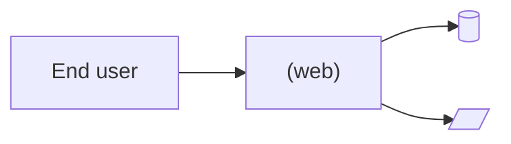

<!--
This README is the basis for the template's render.com/templates/<slug> page.
Fill EVERY placeholder. Cut sections only if they truly do not apply (and
note why in the commit). Keep tone direct, second-person ("you"), no
marketing fluff. See ../references/readme-template.md for per-section
guidance and word-count targets.
-->

# <PROJECT_NAME> on Render

> <ONE_SENTENCE_PITCH>

[](https://render.com/deploy-template/api/github/start?template_repo=<TEMPLATE_REPO_SLUG>)

<TWO_TO_THREE_SENTENCE_ELABORATION_OF_WHAT_USERS_GET>


---

## Table of contents

- [Why deploy <PROJECT_NAME> on Render](#why-deploy-project_name-on-render)
- [Use cases](#use-cases)
- [What gets deployed](#what-gets-deployed)
- [Quickstart](#quickstart)
- [Configuration](#configuration)
- [Cost breakdown](#cost-breakdown)
- [Customization](#customization)
- [Operations](#operations)
- [Upgrading](#upgrading)
- [Troubleshooting](#troubleshooting)
- [FAQ](#faq)
- [Security](#security)
- [Caveats and limitations](#caveats-and-limitations)
- [Credits and license](#credits-and-license)

---

## Why deploy <PROJECT_NAME> on Render

- **<VALUE_PROP_1>** — <ONE_LINE>
- **<VALUE_PROP_2>** — <ONE_LINE>
- **<VALUE_PROP_3>** — <ONE_LINE>
- **<VALUE_PROP_4>** — <ONE_LINE>

## Use cases

What you can build or run with this template:

- **<USE_CASE_1>** — <ONE_LINE>
- **<USE_CASE_2>** — <ONE_LINE>
- **<USE_CASE_3>** — <ONE_LINE>

## What gets deployed



| Resource | Type | Plan | Purpose |
|----------|------|------|---------|
| `<SERVICE_NAME>` | <SERVICE_TYPE> | <PLAN> | <PURPOSE> |
| `<DB_NAME>` | <DB_TYPE> | <PLAN> | <PURPOSE> |
| `<DISK_NAME>` | Disk (<SIZE> GB) | — | <PURPOSE> |

Region: **<REGION>** (override in `render.yaml` if you want a different one).

## Quickstart

1. Click **[Deploy to Render](https://render.com/deploy-template/api/github/start?template_repo=<TEMPLATE_REPO_SLUG>)**.
2. <STEP_2>
3. <STEP_3>
4. <STEP_4>
5. Open the `*.onrender.com` URL once the deploy is `live` (~<N> minutes).

<OPTIONAL_QUICKSTART_SCREENSHOT_OR_GIF>

## Configuration

### Required secrets

You set these in the Render dashboard during the Apply step. If a value is missing the deploy fails fast.

| Env var | What it's for | How to get it |
|---------|---------------|---------------|
| `<KEY>` | <PURPOSE> | <HOW_TO_GET> |

If no rows, write: **None. <REASON>.**

### Auto-generated secrets

Render generates these on first deploy and stores them as service env vars. **Do not rotate them later** — rotating breaks <WHAT_BREAKS>.

| Env var | Purpose |
|---------|---------|
| `<KEY>` | <PURPOSE> |

### Wired automatically from other resources

The Blueprint wires these via `fromDatabase` / `fromService` references. You never type them.

| Env var | Source |
|---------|--------|
| `<KEY>` | `<RESOURCE_NAME>.<PROPERTY>` |

### Optional tweaks

Common things people change after deploying. All of these are env vars you can add or override in the dashboard or in `render.yaml`.

| Env var | Default | What it does |
|---------|---------|--------------|
| `<KEY>` | `<DEFAULT>` | <WHAT_IT_DOES> |

Full upstream config reference: [<UPSTREAM_CONFIG_DOCS_TITLE>](<UPSTREAM_CONFIG_DOCS_URL>).

## Cost breakdown

| Resource | Plan | Monthly cost |
|----------|------|--------------|
| <SERVICE_NAME> | <PLAN> | $<N> |
| <DB_NAME> | <PLAN> | $<N> |
| <DISK_NAME> | <SIZE> GB | $<N> |
| **Total** | | **$<TOTAL>** |

Render's full pricing: [render.com/pricing](https://render.com/pricing).

**Cheaper:** <HOW_TO_REDUCE_COST>.
**Scale up:** <HOW_TO_SCALE_UP>.

## Customization

### Pin the upstream version

This template defaults to <DEFAULT_VERSION_PIN>. To pin to a specific upstream release:

```yaml
# render.yaml
<HOW_TO_PIN>
```

### Add a custom domain

In the Render dashboard, open the service → **Settings** → **Custom Domains** → **Add**. Render issues TLS automatically. See [render-domains](https://render.com/docs/custom-domains) for DNS setup.

### <CUSTOMIZATION_3>

<HOW_TO>

### <CUSTOMIZATION_4>

<HOW_TO>

## Operations

### Backups

<BACKUP_STORY>

### Monitoring

<MONITORING_STORY>

### Scaling

<SCALING_STORY>

### Logs

In the Render dashboard, open the service → **Logs**. CLI: `render logs --resources <service-id> --tail`.

## Upgrading

### Pick up upstream releases

<HOW_TO_BUMP_UPSTREAM>

### Breaking-change migrations

Watch the upstream [changelog](<UPSTREAM_CHANGELOG_URL>) before upgrading across major versions. Notable migrations to date:

- **<VERSION>** — <WHAT_CHANGED_AND_HOW_TO_MIGRATE>

## Troubleshooting

### Deploy fails during image pull

<CAUSE_AND_FIX>

### Service starts but health check fails

<CAUSE_AND_FIX>

### `<COMMON_ERROR_MESSAGE>`

<CAUSE_AND_FIX>

### Anything else

- Service-level logs: dashboard → **Logs** (or `render logs --resources <id> --tail`)
- Deploy-level logs: dashboard → **Events** → click the failed deploy
- Open an issue in this template repo for template-specific bugs
- Open an issue [upstream](<UPSTREAM_ISSUES_URL>) for application bugs

## FAQ

### <QUESTION_1>

<ANSWER>

### <QUESTION_2>

<ANSWER>

### <QUESTION_3>

<ANSWER>

### Can I run this on Render's free plan?

<ANSWER>

### Can I move my data off the disk later?

<ANSWER>

## Security

- **Encryption at rest:** <STATEMENT>
- **Encryption in transit:** TLS to the `*.onrender.com` hostname and to managed Postgres.
- **Network exposure:** <WHAT_IS_PUBLIC_VS_PRIVATE>
- **Secret rotation:** <WHICH_SECRETS_ARE_SAFE_TO_ROTATE_VS_DANGEROUS>
- **Reporting vulnerabilities:** template issues → this repo, application issues → [upstream security policy](<UPSTREAM_SECURITY_URL>)

## Caveats and limitations

- <CAVEAT_1>
- <CAVEAT_2>
- <CAVEAT_3>

## Credits and license

- **Upstream:** [<UPSTREAM_NAME>](<UPSTREAM_URL>) — <UPSTREAM_LICENSE>
- **Render template:** MIT (see [LICENSE](./LICENSE))
- **Template maintainer:** [<OWNER>](https://github.com/<OWNER>)

If this template helped you, give the upstream repo a star.
